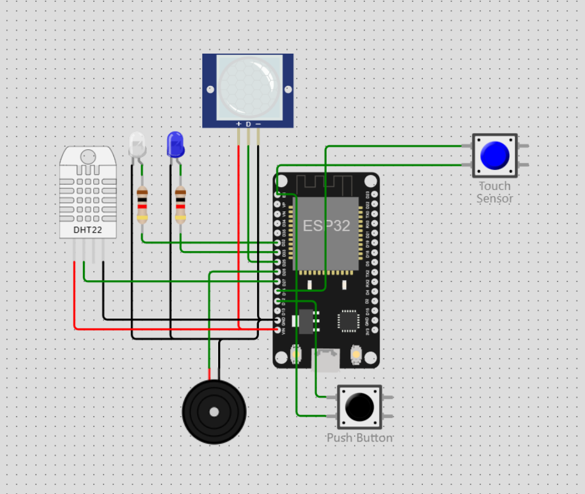
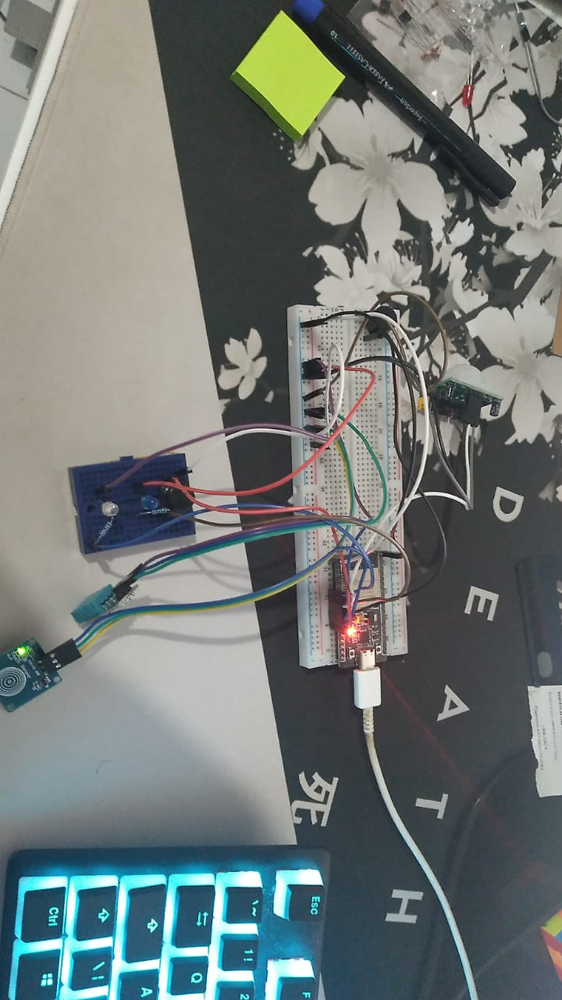
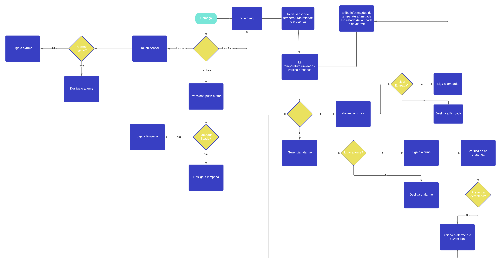
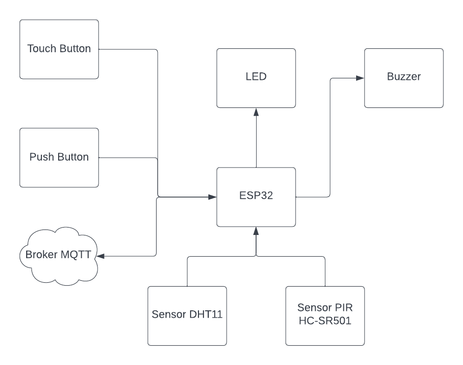

# Sistemas Embarcados - 2022.2

<p align="center">
  
</p>
<h1 align="center">
  Automação Residencial
</h1>

> Vídeo da apresentação [link](https://youtu.be/3gIauqteiv0)

<!-- Badges -->
<p align="center">

  

  <!-- GitHub repo size -->
  

  <!-- Social -->  
  <a href="https://github.com/jpalvesl/ecoleta/stargazers">
    
  </a>

  <!-- more badges here -> https://gist.github.com/tterb/982ae14a9307b80117dbf49f624ce0e8 -->

## 1. Instituição

-   Instituto Federal da Paraíba - IFPB
-   Campus Campina Grande

## 2. Docente responsável

-   [Professor Dr. Alexandre Sales Vasconcelos](https://github.com/alexandresvifpb)

## 3. Grupo

-   [Iasmin Santos Lucena](https://github.com/iasminsantosx)
-   [João Pedro Alves de Lima](https://github.com/jpalvesl)
-   [Myrlla Lucas Pereira](https://github.com/myrlla)

## 4. Descrição do projeto
É aplicação residencial, utilizando o microcontrolador ESP32. Que visa a ativação de alarme e ligação das lâmpadas pela internet ou pelo próprio ESP, além da coleta das informações vindas dos sensores, para monitoramento à distância via internet, no caso pelo protocolo MQTT.

## 5. Objetivos

### 5.1. Geral
Atraves do MQTT fazer uma aplicação ter interações de forma remota, visando a comodidade do usuário, como também ser de facil extensão atraves da adição de novos sensores.
### 5.2. Específicos
- Realizar comunicação via internet
- Fazer uma forma de interação mais simples para o usuário final


## 6. Resumo das arquiteturas
Todo _Hardware_ apresentado no tópico 6.1 foi construído no sistema WOKWI e o _Firmware e/ou Software/App_ utilizando o Visual Studio Code, com arquitetura do ESP-IDF.

### 6.1 Componentes
1. ESP32
2. Buzzer Ativo
3. LED
4. Sensor Touch (TTP223)
5. Sensor de presença (PIR HC-SR501)
6. Switch 12x12x7.5
7. Sensor de umidade e temperatura DHT11

### 6.2. Montagem
- Circuito Montado



- Projeto montado



## 7. Fluxograma



## 8. Diagrama de Bloco



## 9. Resumo dos Resultados
O objetivo básico do projeto foi alcançado. Os sensores de movimento(HC-SR501) e de umidade e temperatura(DHT11) foram montados de forma correta e capazes de capturar as informações necessárias para o funcionamento do protótipo, como a movimentação para o disparo do alarme e ligação das lâmpadas. Além da distribuição desses dados(Temperatura e presença) pela internet via protocolo MQTT. O projeto também conseguiu fazer a comunicação do ESP32 com a internet a fim de controle dos componentes da aplicação. Outra funcionalidade alcançada foi a instalação de um botão físico que liga o relé e ativa as luzes presencialmente, já para a ativação presencial do Buzzer(alarme) foi utilizado o sensor de toque TTP223. Com ativação do alarme tanto via física como via internet, ele utilizará o sensor de presença para verificar e se houver presença disparar o som do Buzzer e exibir uma mensagem na CLI informando que o alarme foi acionado.

## 10. Conclusão
Ao longo do desenvolvimento foram encontradas algumas dificuldades, pois foi a primeira que desenvolvemos um projeto utilizando o esp32, uma delas foi a conexão com a internet, pois queríamos desenvolver um sistema web, mas para isso era necessário fazer conexão websocket e para realizar a conexão com o esp só conseguimos usando o tcp. Implementamos a conexão usando o tcp usando a CLI como interface por conta do impasse que tivemos em criar a página web com o MQTT. Para trabalhos futuros, após uma maior prática e tendo um conhecimento melhor sobre o desenvolvimento de projetos usando sistemas embarcados, gostaríamos de realizar a criação de uma interface mais amigável para o usuário e implementar novas funções para a automação residencial. Pois com a realização do projeto foi possível concluir, que microcontroladores são grandes facilitadores no desenvolvimento de automações residenciais, já que nos dias de hoje, casas inteligentes são cada vez mais desejo de consumo.


## 11 Como usar

1. Baixar o repositório

```sh
git clone https://github.com/jpalvesl/sistemas-embarcados-projeto
```

2. Entrar na pasta da CLI
```sh
cd apps/mqtt-cli
```

3. Rodar o CLI
```sh
node src/index.js
```

## 🧐 Tecnologias usadas?

### :building_construction: Tecnologias usadas
- [ESP-IDF](https://pt-br.reactjs.org/)
- [Nodejs](https://nodejs.org/en/)
</p>

### :package: Pacotes usados no Projeto ESP
- [DHT](https://github.com/UncleRus/esp-idf-lib/tree/master/components/dht)

### :package: Pacotes usados na CLI
- [MQTT.js](https://github.com/mqttjs/MQTT.js)


### :open_file_folder: Aplicações separadas
- [Projeto ESP](https://github.com/jpalvesl/sistemas-embarcados-projeto/tree/main/apps/projeto-esp)
- [CLI](https://github.com/jpalvesl/sistemas-embarcados-projeto/tree/main/apps/mqtt-cli)

---

Feito com amor por 💙 By [Iasmin Santos](https://github.com/iasminsantosx),  [João Lima](https://github.com/jpalvesl) e  [Myrlla Lucas](https://github.com/myrlla)


Projeto feito para a disciplina de Sistemas Embarcados do semestre 2022.2 Engenharia de Computação.

